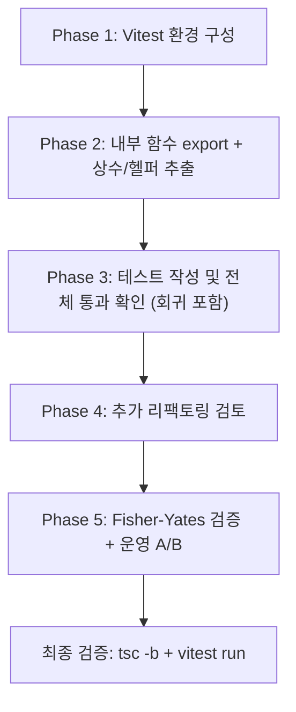

# Vitest 연동 및 balance-teams 테스트/리팩토링 계획

## 1. 현황 분석

### 프로젝트 스택

| 항목       | 내용                                       |
| ---------- | ------------------------------------------ |
| 빌드       | Vite 7, `@vitejs/plugin-react`             |
| UI         | React 19, Ant Design 5, lucide-react, SCSS |
| 상태관리   | Zustand + Immer                            |
| TypeScript | ~5.8.3                                     |
| 린트       | ESLint 9, typescript-eslint                |
| 아키텍처   | FSD(Feature-Sliced Design) 기반            |

### 테스트 환경 현황

- `package.json`에 `"test": "vitest"` 스크립트 존재
- **vitest 패키지 미설치** (devDependencies에 없음)
- `jsdom`은 이미 devDependency에 설치됨
- `vitest.config.ts` 또는 `vite.config.ts`의 `test` 설정 없음
- 프로젝트 전체 테스트 파일 **0개**

### balance-teams.ts 분석

- 파일 위치: `src/entities/team/lib/balance-teams.ts` (463줄)
- `balanceTeams` 1개만 export, 내부 함수 11개는 모듈 스코프에 갇혀 단위 테스트 불가
- 랜덤 로직(`Math.random`)이 전반에 사용되어 결정적 테스트를 위한 mock 필요

---

## 2. Phase 1 — Vitest 환경 구성

### 2.1 패키지 설치

```bash
pnpm add -D vitest
```

> `jsdom`은 이미 설치되어 있으므로 추가 불필요

### 2.2 vite.config.ts 수정

```typescript
// vite.config.ts
import { defineConfig } from 'vite'
/// <reference types="vitest/config" />

export default defineConfig({
  // ...기존 설정 유지
  test: {
    globals: true,
    environment: 'jsdom'
  }
})
```

### 2.3 tsconfig.app.json 수정

```jsonc
{
  "compilerOptions": {
    // ...기존 옵션
    "types": ["vitest/globals"]
  }
}
```

---

## 3. Phase 2 — balance-teams.ts 리팩토링

> **원칙**: 기능 변경 절대 금지. `balanceTeams(players, mode): Team[]` 공개 API 시그니처와 반환 구조 유지.

### 3.1 내부 함수 테스트 노출 (public export 최소화)

원칙은 `@/entities` 공개 API를 늘리지 않는 것이다.  
내부 함수 테스트를 위해 `balance-teams.ts`에서 named export는 허용하되, barrel(`src/entities/team/lib/index.ts`, `src/entities/index.ts`)에는 **`balanceTeams`만** 노출한다.

- `src/entities/team/lib/index.ts`를 `export { balanceTeams } from './balance-teams'` 형태로 제한
- 테스트 코드는 `@/entities`가 아닌 내부 파일 경로에서만 helper를 import
- helper export에는 `/** @internal test-only */` 주석으로 의도 명시

| 분류          | 테스트 노출 대상 함수                                                                            |
| ------------- | ----------------------------------------------------------------------------------------------- |
| 순수 유틸리티 | `calculateTeamStrength`, `getMovablePlayers`, `getTeamTierCounts`, `shuffleArray`               |
| 배분          | `distributeRegularPlayers`, `distributeGuests`                                                  |
| 밸런싱        | `balanceTeamStrength`, `balanceTeamSize`, `balanceAceDisadvantage`, `balanceBeginnerHeavyTeams` |
| 특수 규칙     | `enforceExcludedPairs`                                                                          |
| 컨디션        | `setPlayerCondition`                                                                            |

### 3.2 중복 티어 가중치 상수 추출

**문제**: 동일한 가중치 맵이 두 곳에 하드코딩

```typescript
// calculateTeamStrength (L12-16)
const tierWeights = { ace: 4, advanced: 3, intermediate: 2, beginner: 1 }

// distributeGuests (L174)
const weights = { ace: 4, advanced: 3, intermediate: 2, beginner: 1 }
```

**개선**: `constants.ts`에 `TIER_WEIGHTS` 상수로 추출

```typescript
// src/entities/team/lib/constants.ts
export const TIER_WEIGHTS: Record<string, number> = {
  ace: 4,
  advanced: 3,
  intermediate: 2,
  beginner: 1
} as const
```

### 3.3 반복되는 선수 교환 패턴 추출

**문제**: `balanceAceDisadvantage`, `balanceBeginnerHeavyTeams`, `enforceExcludedPairs` 세 함수에서 동일한 교환 패턴이 반복

```typescript
// 반복되는 패턴 (3곳)
teamA.players = teamA.players.filter((p) => p.id !== playerX.id)
teamB.players = teamB.players.filter((p) => p.id !== playerY.id)
teamA.players.push(playerY)
teamB.players.push(playerX)
```

**개선**: 헬퍼 함수 추출

```typescript
function swapPlayersBetweenTeams(teamA: Team, playerA: Player, teamB: Team, playerB: Player): void {
  teamA.players = teamA.players.filter((p) => p.id !== playerA.id)
  teamB.players = teamB.players.filter((p) => p.id !== playerB.id)
  teamA.players.push(playerB)
  teamB.players.push(playerA)
}
```

### 3.4 "가장 약한 팀 찾기" 패턴 추출

**문제**: `distributeGuests`에서 약한 팀 찾기 로직이 여러 번 반복

**개선**: `findWeakestTeam(teams, maxSize?)` 헬퍼로 추출

### 3.5 shuffleArray 개선

**문제**: `sort(() => Math.random() - 0.5)`은 비균등 분포 문제가 있음

**개선**: Fisher-Yates 알고리즘으로 교체

```typescript
function shuffleArray<T>(array: T[]): T[] {
  const result = [...array]
  for (let i = result.length - 1; i > 0; i--) {
    const j = Math.floor(Math.random() * (i + 1))
    ;[result[i], result[j]] = [result[j], result[i]]
  }
  return result
}
```

> Fisher-Yates 도입은 분포 특성 변화가 있으므로, 즉시 치환하지 않고 운영 검증 단계(Phase 5)로 분리

### 3.6 `distributeGuests` 빈 배열 reduce 버그 수정 (필수)

현 코드에는 아래 경로에서 런타임 예외 가능성이 있다.

- `connectedGuest`가 있으나 `playersPerTeam` 미만 팀이 하나도 없을 때
- `teams.filter((t) => t.players.length < playersPerTeam)` 결과가 빈 배열인데 `reduce` 호출

수정 원칙:

- 빈 배열이면 `reduce`를 호출하지 않도록 가드 추가
- fallback 정책을 명시적으로 선택 (`전체 팀 중 weakest` 또는 `skip + 경고`)
- 회귀 테스트를 **CRITICAL**로 추가하여 동일 장애 재발 방지

---

## 4. Phase 3 — 테스트 코드 작성

### 4.1 테스트 파일 위치

```
src/entities/team/lib/__tests__/balance-teams.test.ts
```

### 4.2 테스트 전략

- `Math.random`을 `vi.spyOn(Math, 'random')`으로 mock하여 결정적 테스트 보장
- 테스트용 Player 팩토리 함수로 fixture 생성 간소화
- 각 함수를 독립적으로 단위 테스트한 뒤, `balanceTeams` 통합 테스트 수행

### 4.3 테스트 케이스 상세

#### 순수 유틸리티 함수

| 함수                    | 테스트 케이스                                      |
| ----------------------- | -------------------------------------------------- |
| `calculateTeamStrength` | ACE 4점, ADVANCED 3점 등 각 티어 조합별 합산 검증  |
| `getMovablePlayers`     | 게스트 제외, 연결선수 제외, excludeTiers 필터 동작 |
| `getTeamTierCounts`     | 각 티어별 정확한 카운트 반환                       |
| `shuffleArray`          | 원본 배열 불변, 요소 전체 보존, 길이 동일          |

#### 배분 함수

| 함수                       | 테스트 케이스                                                                                             |
| -------------------------- | --------------------------------------------------------------------------------------------------------- |
| `distributeRegularPlayers` | ACE 라운드로빈 균등배분, BEGINNER 균등배분, ADVANCED는 BEGINNER 많은 팀 우선, INTERMEDIATE는 약한 팀 우선 |
| `distributeGuests`         | 연결된 게스트가 연결선수 팀에 배치, 미연결 게스트 밸런스 배치, 팀 초과 시 교환 처리, **빈 reduce 방지 회귀 케이스** |

#### 밸런싱 함수

| 함수                        | 테스트 케이스                                      |
| --------------------------- | -------------------------------------------------- |
| `balanceTeamStrength`       | 전력 차이 gap <= 2로 수렴, maxIterations 제한 준수 |
| `balanceTeamSize`           | 팀 사이즈 차이 1 이하로 수렴                       |
| `balanceAceDisadvantage`    | ACE 없는 팀에 ADVANCED 보상 교환                   |
| `balanceBeginnerHeavyTeams` | BEGINNER 3명 이상 팀에서 상위 티어 교환            |

#### 특수 규칙

| 함수                   | 테스트 케이스                                                   |
| ---------------------- | --------------------------------------------------------------- |
| `enforceExcludedPairs` | 같은 팀에 있는 쌍을 분리, 1:1 교환 우선, 교환 불가 시 강제 이동 |
| `setPlayerCondition`   | 기본 MID 할당, HIGH 확률 할당, RAINBOW/BEST 선수 제외           |

#### 통합 테스트 (balanceTeams)

| 시나리오          | 검증 항목                        |
| ----------------- | -------------------------------- |
| 5:5 (2팀, 10명)   | 팀 수 2, 각 팀 5명               |
| 6:6 (2팀, 12명)   | 팀 수 2, 각 팀 6명               |
| 5:5:5 (3팀, 15명) | 팀 수 3, 각 팀 5명               |
| 게스트 포함       | 게스트가 올바르게 배치됨         |
| 전체 선수 보존    | 입력 선수 전원이 결과 팀에 존재  |
| 배제 쌍 분리      | '지원 1', '지원 2'가 다른 팀     |
| 밸런스            | 팀 간 전력 차이가 허용 범위 이내 |
| 회귀 방지         | `distributeGuests` 빈 reduce 경로에서도 throw 없이 완료 |

---

## 5. Phase 4 — 추가 리팩토링 검토

balance-teams.ts 외 관련 파일 검토 결과:

| 파일                                  | 결론                                 |
| ------------------------------------- | ------------------------------------ |
| `src/entities/team/model/store.ts`    | 단순 Zustand 스토어, 리팩토링 불필요 |
| `src/entities/team/lib/constants.ts`  | `TIER_WEIGHTS` 추가 외 변경 없음     |
| `src/entities/team/model/types.ts`    | 현 상태 적절                         |
| `src/entities/player/model/player.ts` | PlayerClass 구조 양호                |

---

## 6. Phase 5 — Fisher-Yates 도입 검증 및 운영 A/B 비교

목표: 셔플 알고리즘 변경으로 팀 분배 결과 편향/품질이 악화되지 않는지 검증 후 도입

### 6.1 사전 검증 (로컬/CI)

- 고정 seed 시뮬레이션(or 고정 random sequence mock)으로 기존 vs Fisher-Yates 결과 비교
- 지표:
  - 팀 전력 gap 분포 (평균/최대)
  - beginner 편중 팀 비율
  - exclude pair 충돌 발생률

### 6.2 운영 A/B

- 플래그 기반으로 `legacy_shuffle` vs `fisher_yates` 분기
- 최소 2주 수집, 동일 입력 분포에서 지표 비교
- 롤백 조건: 기존 대비 품질 지표가 악화되면 즉시 legacy로 복귀

### 6.3 도입 조건

- 사전 검증 통과 + 운영 A/B에서 비열화(non-inferiority) 확인 시 기본값 전환

---

## 7. 실행 순서 요약



---

## 8. 핵심 원칙

1. **기능 변경 금지**: `balanceTeams(players, mode): Team[]` 시그니처와 반환 구조 절대 불변
2. **테스트 우선**: 리팩토링 전 테스트 작성 → 리팩토링 후 동일 테스트 통과 확인
3. **운영 안정성**: 현재 운영 중인 서비스이므로 모든 변경은 동작 보존이 전제
4. **공개 API 최소화**: 내부 테스트를 위해 노출하더라도 `@/entities` 공개 표면적은 확장하지 않음
5. **회귀 우선 방어**: 발견된 런타임 예외 경로는 버그픽스+회귀 테스트를 같은 단계에서 처리
